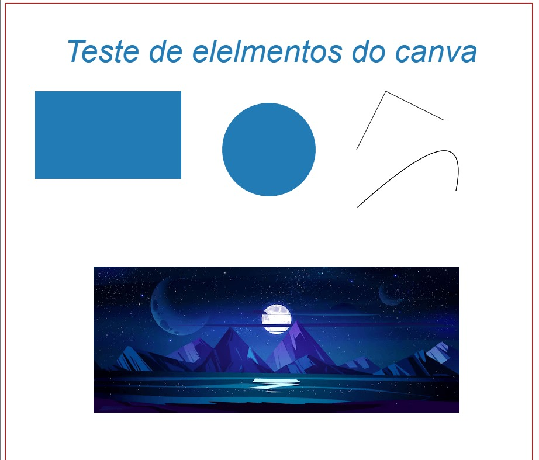

<h1 align="center">Atividade-Canvas</h1>
  
<ul>
<li><h3>Index.html</h3></li>

Para começarmos a fazer o exercício proposto pensamos em como o site já ficaria quando pronto para termos uma base de que fazer 

Fomos fazer o HTML básico com um HEAD e um BODY que liga ao CSS e o JAVA SCRIPT. 

Dentro do BODY utilazmos um código para criar o elemento canva. 

<body>

  <canvas id=”UgCanvas” width=”” height=”” style=”border:1px solid #;”>

   </canvas>

  

<li><h3>script.js</h3></li>

O código em si não faz muita coisa sem o código do java script, isso seria apenas uma tela em branco e o pintor seria os códigos do Java. 
  
Dentro do código do java utilizamos códigos que efetuam linhas como o “stroke” 
  
Juntamente com o “fillstyle “ para preencher e dar cores aos desenhos  
  
E com o “fillrect” para criar as formar e dar tamanhos a elas  
  
Para colocarmos a imagem dentro de um canva utilizamos um código de puxar imagem normal. 

E assim ficou o site com as coisas feitas e coloridas  

  

